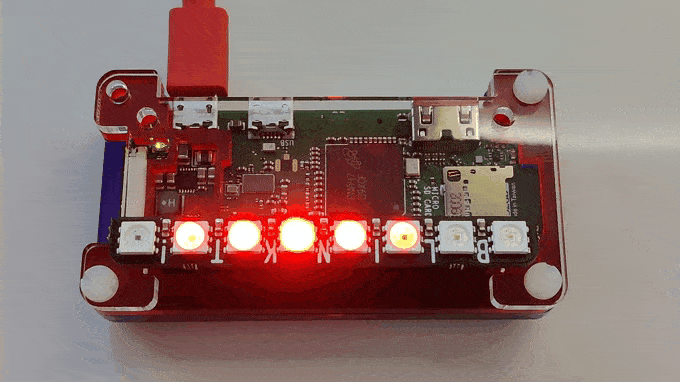

# Agile Blinkt!

An Octopus Agile and Energy Consumption Visualizer.

This script is written to be used with the Pimoroni Blinkt LED board,
Octopus Energy Agile price tariff, and a live power consumption/export
feed (e.g. from Open Emon CMS). Of course, you could use other similar data sources if available. 

It displays a Larson oscillating LED display (aka Knight Rider)
that changes speed and changes colour according to the power consumption,
power export, or Agile price at the moment.

The more energy that's being consumed (or generated) the faster the LED animation.

The higher the Agile price the more red the colour gets, the lower the price
the more blue it gets (negative prices), and if exporting energy the 
color is sunshine yellow! yay!

All data is received over MQTT, one topic per field. I chose this method
because MQTT was easy to integrate with Home Assistant. HA has excellent support
for many add-ons and many IoT devices, it has custom components for collecting
prices from Agile and power from EmonCMS. So overall it makes a good 'hub'. 

I wrote this script to help my family to be more aware of the current 
energy consumption, generation and prices. And with a bit luck, create some behaviour
changes! It's intended to be a passive piece of furniture, intuitively
visualizing our homes energy data. 

Enjoy.

Components used:
* [Pimoroni Blinkt board](https://shop.pimoroni.com/products/blinkt)
* [Octopus Energy Agile](https://octopus.energy/agile/)
* [EmonCMS power monitor](https://openenergymonitor.org/)
* [Home Assistant](https://www.home-assistant.io/)

